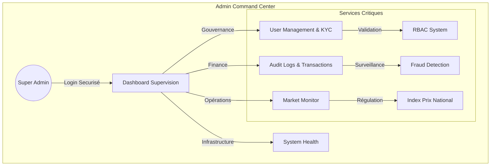
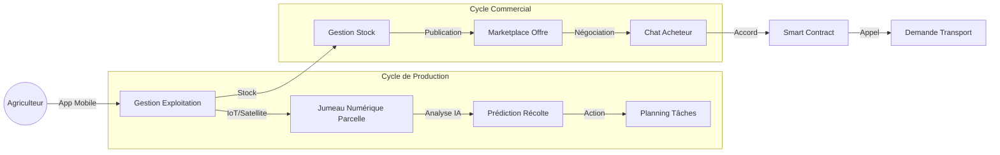
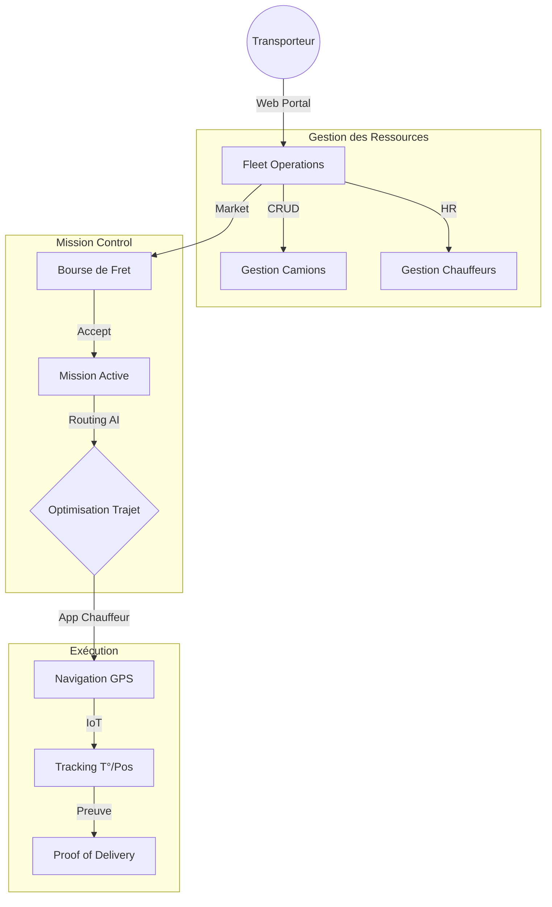
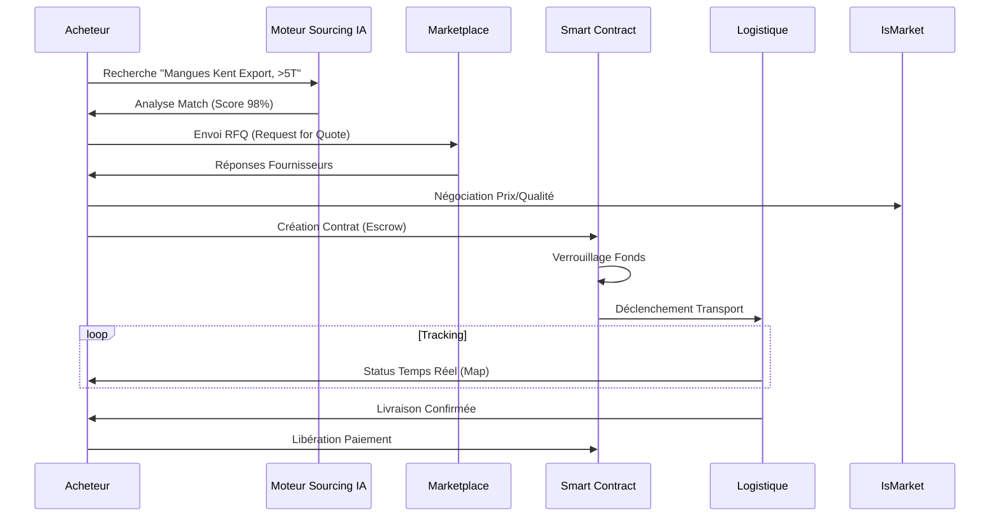

# 🌾 AgriLogistic - Plateforme de Logistique Agricole Intelligente


> **"L'OS de l'Agriculture Africaine"** : De la production à la consommation, une chaîne de valeur unifiée par la Data, l'IA et la Blockchain.

---

## 1️⃣ Présentation Globale

### 🌍 Vision & Mission
**AgriLogistic** a pour mission de construire l'infrastructure numérique structurante de l'agriculture africaine. Nous remplaçons l'informel et l'opacité par une **plateforme SaaS intégrée** qui connecte producteurs, logisticiens et acheteurs industriels.
Notre vision : **Transformer chaque acteur de l'agriculture en une entreprise technologique data-driven.**

### 🛑 Problèmes Résolus
*   **Opacité Structurale :** 60% du prix final est capté par des intermédiaires non-valeur ajoutée.
*   **Pertes Post-Récolte :** 40% de la production perdue faute de logistique adaptée.
*   **Risque de Contrepartie :** Manque de confiance dans les paiements et la qualité.
*   **Exclusion Bancaire :** Absence de scoring crédit pour les acteurs ruraux.

### 💡 Valeur Ajoutée par Acteur
| Acteur | Bénéfice Clé |
| :--- | :--- |
| **🌱 Agriculteur** | **Accès Marché** : Vente directe, réduction des pertes, conseils agronomiques IA. |
| **🚚 Transporteur** | **Optimisation** : Réduction des trajets à vide, revenus garantis, gestion de flotte. |
| **🛒 Acheteur** | **Sourcing Sécurisé** : Traçabilité totale, conformité ESG, contrats intelligents. |
| **👑 Admin** | **Gouvernance** : Pilotage macro-économique, régulation, sécurité nationale. |

---

## 2️⃣ Structure Globale de Fonctionnement

Le système AgriLogistic fonctionne comme un **Cerveau Central** qui orchestre les interactions physiques et financières.

### Flux de Données & Décisionnel
1.  **Input (Terrain)** : L'agriculteur digitalise sa parcelle (Jumeau Numérique) et déclare une récolte.
2.  **Processing (Cloud)** : L'IA estime le rendement, la qualité et suggère un prix de marché.
3.  **Matching (Moteur)** : L'offre rencontre une demande (Acheteur) et un vecteur logistique (Transporteur).
4.  **Output (Réel)** : Le Smart Contract verrouille les fonds, le camion part, la livraison est tracée.

---

## 3️⃣ Diagrammes Fonctionnels (Détaillés)

### 👑 A. Rôle Admin (Gouvernance & Supervision)
L'Admin dispose d'une vue "Dieu" sur le système. Il gère l'infrastructure, la conformité et la santé économique de la plateforme.



### 🌱 B. Rôle Agriculteur (Production)
L'interface Agriculteur est centrée sur l'optimisation du rendement et la vente rapide au meilleur prix.



### 🚚 C. Rôle Transporteur (Logistique)
Le Transporteur utilise un véritable "Dispatch System" pour gérer sa flotte et maximiser sa rentabilité au kilomètre.



### 🛒 D. Rôle Acheteur (Sourcing)
L'Acheteur dispose d'outils de sourcing avancés pour sécuriser ses approvisionnements en qualité et quantité.



---

## 4️⃣ Fonctionnalités Complètes (A → Z)

### 👑 Admin
*   **User Management (RBAC)** : Gestion fine des droits, validation KYC des entreprises.
*   **Global Analytics** : Carte de chaleur des flux, volumes financiers, détection d'anomalies.
*   **Market Regulation** : Outils de modération des offres, suspension de comptes frauduleux.
*   **Content Management** : Gestion du Blog, de l'Académie Agri et des notifications système.

### 🌱 Agriculteur
*   **Digital Twin** : Carte 3D des parcelles (Three.js) avec couches de données (Météo, Sol).
*   **Yield Predictor** : Modèle IA estimant le tonnage futur basé sur l'imagerie historique.
*   **Agri-Wallet** : Portefeuille numérique pour recevoir les paiements et payer les services.
*   **Marketplace Publisher** : Création d'annonces riches (Photos, Certificats, Prix).

### 🚚 Transporteur
*   **Fleet Commander** : Vue 360° de la flotte (Maintenance, Assurances, Localisation).
*   **Smart Dispatch** : Algorithme d'assignation automatique (Camion le plus proche/adapté).
*   **Route Optimizer** : Calcul d'itinéraire multi-points réduisant le carburant (Google OR-Tools).
*   **E-Docs** : Digitalisation des lettres de voiture et preuves de livraison (QR Code).

### 🛒 Acheteur
*   **AI Quality Predict** : Analyse visuelle des produits par IA avant achat.
*   **Reverse RFQ** : L'acheteur poste un besoin, l'algo trouve les fournisseurs.
*   **Supply Chain Map** : Vue temps réel de tous les camions transportant ses marchandises.
*   **Contract Builder** : Générateur de contrats juridiques adaptés au droit OHADA.

---

## 5️⃣ Technologies Utilisées (Stack Moderne)

### 🎨 Frontend (Expérience Utilisateur)
*   **Framework** : **Next.js 14** (App Router, Server Components)
*   **UI Library** : **Shadcn/UI** + **Tailwind CSS v4** (Design System cohérent)
*   **Data Viz** : **Recharts** (Analytics) + **React-Leaflet** (Cartographie)
*   **3D Engine** : **React Three Fiber** (Jumeaux Numériques, Visualisation Flotte)
*   **State** : **Zustand** (Gestion d'état global léger et performant)

### ⚙️ Backend (Puissance & Logique)
*   **Core API** : **NestJS** (Architecture modulaire, TypeScript strict)
*   **AI Services** : **Python (FastAPI)** (Microservices ML dédiés)
*   **API Gateway** : **Kong** (Sécurité, Rate Limiting, Routing)

### 🔄 Data & Temps Réel
*   **Events** : **Apache Kafka** (Event-Driven Architecture)
*   **Real-time** : **Socket.io** (Tracking GPS, Notifications Push, Chat)
*   **Databases** :
    *   **PostgreSQL** (Données relationnelles, PostGIS pour géo)
    *   **MongoDB** (Catalogues produits, Logs)
    *   **Redis** (Caching haute performance, Sessions)
    *   **ClickHouse** (Analytics Big Data)

### 🧠 IA & Optimisation
*   **Machine Learning** : **TensorFlow / Scikit-learn** (Prédiction rendement)
*   **Vector Search** : **Qdrant** (Recherche sémantique, Similarité produits)
*   **Operations Research** : **Google OR-Tools** (Optimisation de tournées VRP)

### 🛡️ Sécurité
*   **Blockchain** : **Hyperledger Fabric** (Private Ledger pour contrats & traçabilité)
*   **Auth** : **Passport.js** + **JWT** (Authentification sécurisée)

---

## 6️⃣ Architecture Technique

AgriLogistic repose sur une architecture **Microservices Hybride** orchestrée par un API Gateway.

### Vue d'Ensemble

```mermaid
graph TD
    Client[Applications Clients] -->|HTTPS| Gateway[Kong API Gateway]
    
    subgraph "Core Backend Services"
        Gateway --> Auth[Auth Service (NestJS)]
        Gateway --> Market[Market Service (NestJS)]
        Gateway --> Logistics[Logistics Service (NestJS)]
    end
    
    subgraph "Intelligence Layer"
        Gateway --> AI[AI Prediction (Python)]
        Gateway --> Opti[Route Optimizer (Python)]
    end
    
    subgraph "Data Persistence"
        Auth --> Postgres[(PostgreSQL)]
        Market --> Mongo[(MongoDB)]
        Market --> Qdrant[(Vector DB)]
        Logistics --> Redis[(Redis Cache)]
    end
    
    subgraph "Event Backbone"
        Market --> Kafka[Apache Kafka]
        Logistics --> Kafka
        AI --> Kafka
    end
```

### Principes Clés
1.  **API Gateway Unifiée** : Point d'entrée unique gérant l'authentification et le routage.
2.  **Séparation des Responsabilités (SoC)** : Le Frontend est découplé du Backend. Chaque service a sa propre base de données (Database-per-service pattern).
3.  **Communication Asynchrone** : Kafka assure la résilience et le découplage entre les services (ex: Commande créée -> Notification envoyée).

---

## 7️⃣ Sécurité & Accès

### 🔒 Sécurité par Design
*   **Pages Privées** : Protection des routes via Middleware Next.js (`middleware.ts`) vérifiant le token JWT et le Rôle.
*   **Encryption** : TLS 1.3 pour le transit, AES-256 pour le stockage des données sensibles.
*   **Input Validation** : Validation stricte (Zod/Class-Validator) pour prévenir XSS et Injections SQL/NoSQL.

### ⚡ Scalabilité
*   **Horizontale** : Les microservices sont stateless et conteneurisés (Docker), prêts pour Kubernetes (K8s).
*   **Caching** : Stratégie de cache agressive (Redis) sur les données de lecture (Catalogue, Prix).

---

## 8️⃣ Vision Future

*   **Phase 1 (Actuel)** : Consolidation des features Logistique & Market (V3.0).
*   **Phase 2 (Q3 2024)** : **Agri-Fintech**. Scoring crédit automatisé basé sur l'historique de production et logistique.
*   **Phase 3 (Q4 2024)** : **Drones & Robotique**. Intégration des flottes autonomes pour le "Dernier Kilomètre Rural".
*   **Phase 4 (2025)** : **Expansion Panafricaine**. Interconnexion des corridors logistiques ouest-africains.

---

**© 2026 AgriLogistic Corp.** - *Architecting the Future of African Agriculture.*
