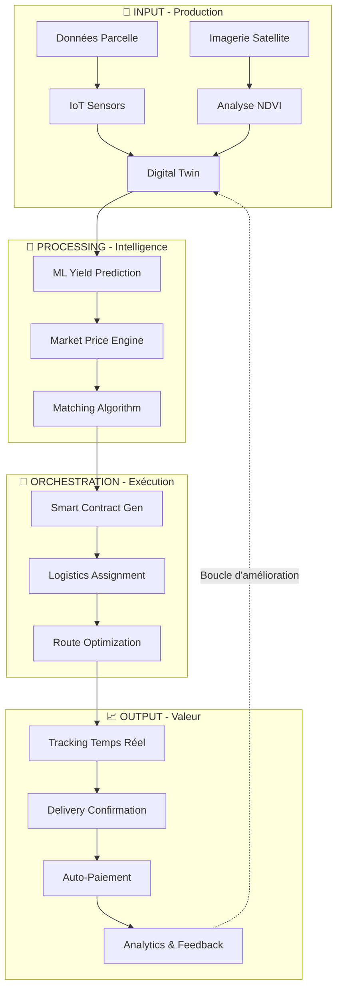
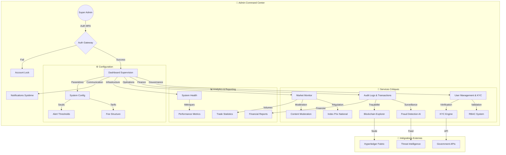
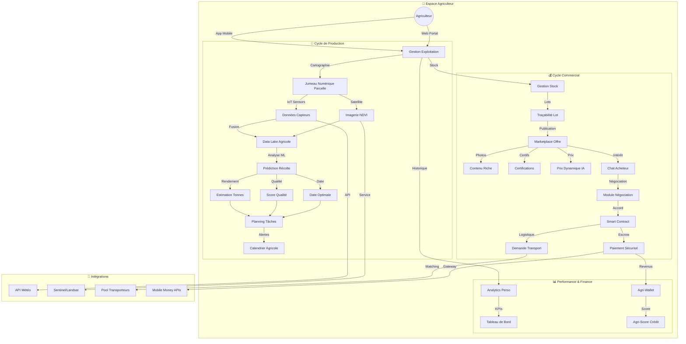
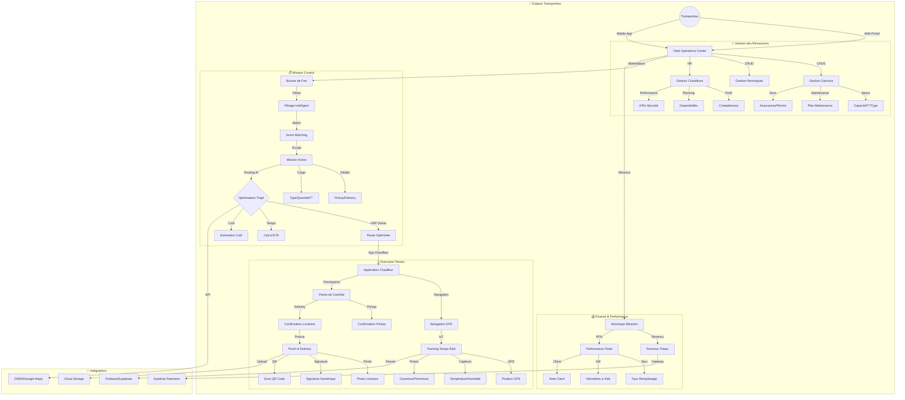
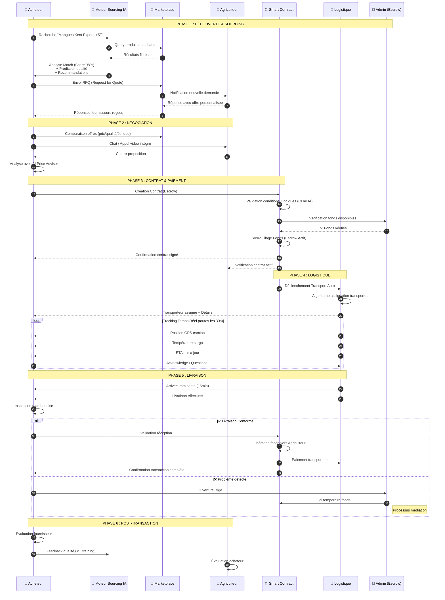
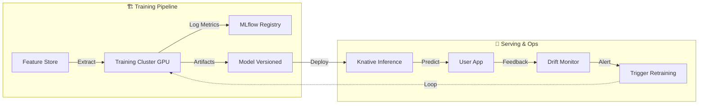
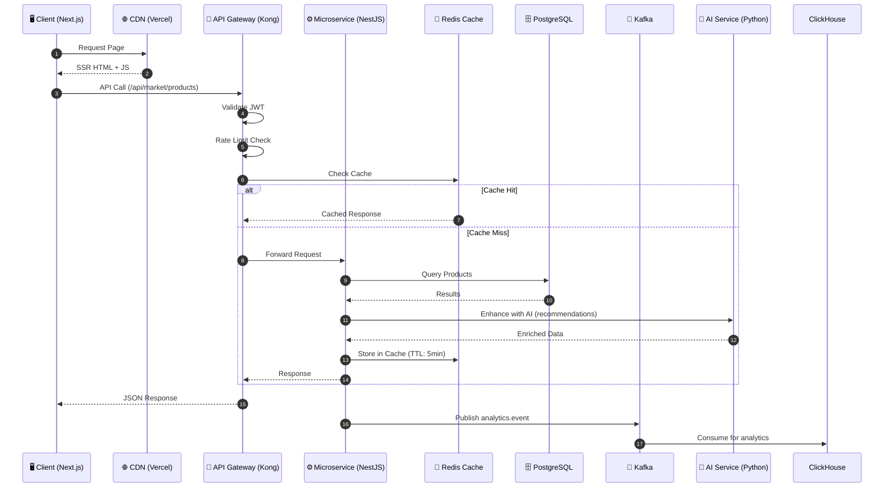

# 🌾 AgriLogistic - Plateforme de Logistique Agricole Intelligente


> **"L'OS de l'Agriculture Africaine"** : De la production à la consommation, une chaîne de valeur unifiée par la Data, l'IA et la Blockchain.

---

## 📑 Table des Matières

1. [Présentation Globale](#1️⃣-présentation-globale)
2. [Structure Globale de Fonctionnement](#2️⃣-structure-globale-de-fonctionnement)
3. [Diagrammes Fonctionnels par Rôle](#3️⃣-diagrammes-fonctionnels-détaillés)
4. [Fonctionnalités Complètes (A → Z)](#4️⃣-fonctionnalités-complètes-a--z)
5. [Technologies Utilisées (A → Z)](#5️⃣-technologies-utilisées-a--z)
6. [Architecture Technique](#6️⃣-architecture-technique)
7. [Sécurité & Accès](#7️⃣-sécurité--accès)
8. [Vision Future](#8️⃣-vision-future)

---

## 1️⃣ Présentation Globale

### 🌍 Vision & Mission

**AgriLogistic** a pour mission de construire l'infrastructure numérique structurante de l'agriculture africaine. Nous remplaçons l'informel et l'opacité par une **plateforme SaaS intégrée** qui connecte producteurs, logisticiens et acheteurs industriels.

Notre vision : **Transformer chaque acteur de l'agriculture en une entreprise technologique data-driven.**

#### 🎯 Objectifs Stratégiques

| Période  | Objectif                        | KPI Cible                   |
| -------- | ------------------------------- | --------------------------- |
| **2024** | Consolidation marché domestique | 10,000 agriculteurs actifs  |
| **2025** | Expansion régionale (UEMOA)     | 50,000 transactions/mois    |
| **2026** | Leadership panafricain          | 500,000 tonnes transportées |

---

### 🛑 Problèmes Résolus dans la Logistique Agricole

| Problème                    | Impact Actuel                                                 | Solution AgriLogistic                                  |
| --------------------------- | ------------------------------------------------------------- | ------------------------------------------------------ |
| **Opacité Structurale**     | 60% du prix final capté par intermédiaires non-valeur ajoutée | Marketplace transparent avec pricing algorithmique     |
| **Pertes Post-Récolte**     | 40% de la production perdue faute de logistique adaptée       | Chaîne du froid digitalisée + optimisation des trajets |
| **Risque de Contrepartie**  | Manque de confiance dans les paiements et la qualité          | Smart Contracts avec escrow et traçabilité blockchain  |
| **Exclusion Bancaire**      | Absence de scoring crédit pour les acteurs ruraux             | Agri-Score basé sur l'historique de production         |
| **Inefficacité Logistique** | 30% des trajets à vide pour les transporteurs                 | Algorithme de matching intelligent et optimisation VRP |

---

### 💡 Valeur Ajoutée par Acteur

| Acteur              | Bénéfice Clé                                                                         | ROI Estimé                     |
| ------------------- | ------------------------------------------------------------------------------------ | ------------------------------ |
| **🌱 Agriculteur**  | **Accès Marché** : Vente directe, réduction des pertes, conseils agronomiques IA     | +35% revenus nets              |
| **🚚 Transporteur** | **Optimisation** : Réduction des trajets à vide, revenus garantis, gestion de flotte | +45% taux de remplissage       |
| **🛒 Acheteur**     | **Sourcing Sécurisé** : Traçabilité totale, conformité ESG, contrats intelligents    | -25% coûts d'approvisionnement |
| **👑 Admin**        | **Gouvernance** : Pilotage macro-économique, régulation, sécurité nationale          | Vision temps réel du marché    |

---

### 🚀 Positionnement Futuriste & Data-Driven

AgriLogistic se positionne comme la **première plateforme agricole cognitive** en Afrique, intégrant :

- **🧠 Intelligence Artificielle Prédictive** : Anticipation des rendements, prix et demandes
- **🔗 Blockchain de Traçabilité** : Certificat d'origine immuable pour l'export
- **📡 IoT Agricole** : Capteurs de sol, météo connectée, tracking GPS
- **🤖 Automatisation** : Workflows intelligents de bout en bout

---

## 2️⃣ Structure Globale de Fonctionnement

### 🏗️ Vue d'Ensemble du Système AgriLogistic

Le système AgriLogistic fonctionne comme un **Cerveau Central** qui orchestre les interactions physiques et financières entre tous les acteurs de l'écosystème agricole.

```
┌─────────────────────────────────────────────────────────────────────────┐
│                    AGRI-LOGISTIC : CERVEAU CENTRAL                       │
├─────────────────────────────────────────────────────────────────────────┤
│                                                                          │
│   ┌──────────────┐    ┌──────────────┐    ┌──────────────┐              │
│   │  AGRICULTEUR │◄──►│   PLATFORM   │◄──►│  TRANSPORTEUR│              │
│   │   (Offre)    │    │   (Matching) │    │  (Logistique)│              │
│   └──────────────┘    └──────┬───────┘    └──────────────┘              │
│                              │                                          │
│                              ▼                                          │
│                       ┌──────────────┐                                  │
│                       │   ACHETEUR   │                                  │
│                       │   (Demande)  │                                  │
│                       └──────────────┘                                  │
│                                                                          │
│   ┌─────────────────────────────────────────────────────────────────┐   │
│   │                    LAYERS TECHNIQUES                             │   │
│   │  ┌─────────┐ ┌─────────┐ ┌─────────┐ ┌─────────┐ ┌─────────┐   │   │
│   │  │   IA    │ │  Data   │ │  Real-  │ │  Securité│ │  Block- │   │   │
│   │  │Predictive│ │  Lake   │ │  time   │ │   RBAC   │ │  chain  │   │   │
│   │  └─────────┘ └─────────┘ └─────────┘ └─────────┘ └─────────┘   │   │
│   └─────────────────────────────────────────────────────────────────┘   │
└─────────────────────────────────────────────────────────────────────────┘
```

---

### 🔄 Flux de Données et Décisions

#### Cycle de Valeur AgriLogistic

```
┌─────────────────────────────────────────────────────────────────────────┐
│                         CYCLE DE VALEUR COMPLET                          │
└─────────────────────────────────────────────────────────────────────────┘

PHASE 1 : PRODUCTION              PHASE 2 : COMMERCIALISATION
┌─────────────────┐               ┌─────────────────┐
│  🌱 AGRICULTEUR │               │  🏪 MARKETPLACE  │
│                 │               │                 │
│ • Digitalisation│──────────────►│ • Publication   │
│   parcelle      │   Récolte     │   offre         │
│ • Suivi culture │   estimée     │ • Matching IA   │
│ • Prédiction    │               │ • Négociation   │
│   rendement     │               │   automatisée   │
└─────────────────┘               └────────┬────────┘
                                           │
                                           ▼
PHASE 3 : LOGISTIQUE              PHASE 4 : FINALISATION
┌─────────────────┐               ┌─────────────────┐
│  🚚 TRANSPORTEUR│               │  🤝 SMART CONTRACT│
│                 │               │                 │
│ • Optimisation  │◄──────────────│ • Escrow actif  │
│   tournée       │   Mission     │ • Tracking temps│
│ • Tracking GPS  │   assignée    │   réel          │
│ • Proof of      │               │ • Libération    │
│   Delivery      │──────────────►│   fonds auto    │
└─────────────────┘   Livraison   └─────────────────┘
                      confirmée
```

---

### 🔗 Interactions entre Rôles

| Interaction               | Déclencheur          | Acteurs                   | Résultat                     |
| ------------------------- | -------------------- | ------------------------- | ---------------------------- |
| **Publication Offre**     | Récolte prête        | Agriculteur → Marketplace | Offre visible aux acheteurs  |
| **Matching**              | Recherche produit    | Acheteur ↔ IA            | Suggestions personnalisées   |
| **Négociation**           | Intérêt mutuel       | Agriculteur ↔ Acheteur   | Accord sur prix/quantité     |
| **Escrow**                | Accord trouvé        | Smart Contract            | Fonds verrouillés sécurisés  |
| **Assignation Transport** | Contrat signé        | Transporteur ↔ Mission   | Camion désigné pour pickup   |
| **Tracking**              | Départ camion        | Tous les acteurs          | Visibilité temps réel        |
| **Livraison**             | Arrivée destination  | Transporteur → Acheteur   | Proof of Delivery généré     |
| **Paiement**              | Validation livraison | Smart Contract            | Libération automatique fonds |

---

### 📊 Logique Métier Globale



---

## 3️⃣ Diagrammes Fonctionnels (Détaillés)

---

### 👑 A. Rôle Admin - Gouvernance & Supervision

#### 🎯 Concept & Responsabilités

L'**Admin** dispose d'une vue "Dieu" sur l'ensemble du système. Il assure la gouvernance, la conformité réglementaire et la santé économique de la plateforme.

| **Gouvernance** | Répertoire centralisé des acteurs, segmentation par rôles, gestion des accès | Espace Utilisateurs & KYC |
| **Conformité** | KYC/AML, validation documents d'identité, OCR, FaceMatch AI | Hub de Validation KYC |
| **Traçabilité** | Suivi immuable des lots "Seed to Fork", Certifications | Blockchain & IPFS Explorer |
| **ESG & RSE** | Pilotage impact carbone, éthique, déforestation (EUDR) | Dashboard Développement Durable |
| **Finance & Crédit**| Scoring Agri-Score (IA), gestion des prêts, analyse risques | Moteur de Scoring XGBoost |
| **Sécurité** | Gestion incidents, audit sécurité, backups | SIEM, logs centralisés |
| **Économique** | Régulation prix, monitoring volumes | Analytics avancés |
| **Technique** | Santé système, performance, scaling | Monitoring infrastructure |

#### 🔄 Interactions avec les Autres Rôles

```
┌─────────────────────────────────────────────────────────────────────────┐
│                        ADMIN - INTERACTIONS                              │
└─────────────────────────────────────────────────────────────────────────┘

                              ┌─────────────┐
                              │   👑 ADMIN   │
                              │  (Supervision)│
                              └──────┬──────┘
                                     │
        ┌────────────────────────────┼────────────────────────────┐
        │                            │                            │
        ▼                            ▼                            ▼
┌───────────────┐          ┌───────────────┐          ┌───────────────┐
│  🌱 AGRICULTEUR │          │  🚚 TRANSPORTEUR│          │  🛒 ACHETEUR   │
│               │          │               │          │               │
│ • Validation  │          │ • Validation  │          │ • Validation  │
│   KYC         │          │   licences    │          │   entreprise  │
│ • Suspension  │          │ • Audit flotte│          │ • Limites     │
│   compte      │          │ • Suspension  │          │   crédit      │
│ • Support     │          │   mission     │          • • Litiges     │
│   escalade    │          │ • Support     │          │   gestion     │
└───────────────┘          └───────────────┘          └───────────────┘
```

#### 📋 Diagramme Conceptuel Complet



---

### 🌱 B. Rôle Agriculteur - Production & Commercialisation

#### 🎯 Concept & Responsabilités

L'interface **Agriculteur** est centrée sur l'optimisation du rendement agricole et la commercialisation rapide au meilleur prix.

| Domaine               | Responsabilités                               | Outils             |
| --------------------- | --------------------------------------------- | ------------------ |
| **Production**        | Gestion parcelles, suivi cultures, calendrier | Digital Twin, IoT  |
| **Prédiction**        | Estimation rendements, qualité, timing        | ML Yield Predictor |
| **Stockage**          | Inventaire post-récolte, traçabilité lot      | Gestion de stock   |
| **Commercialisation** | Publication offres, négociation, contrats     | Marketplace, Chat  |
| **Logistique**        | Demande transport, suivi livraisons           | Dispatch system    |
| **Finances**          | Paiements, historique, Agri-Score             | Wallet intégré     |

#### 🔄 Interactions avec les Autres Rôles

```
┌─────────────────────────────────────────────────────────────────────────┐
│                     AGRICULTEUR - INTERACTIONS                           │
└─────────────────────────────────────────────────────────────────────────┘

                              ┌─────────────┐
                              │   👑 ADMIN   │
                              │  (Support &  │
                              │   Validation)│
                              └──────▲──────┘
                                     │
                                     │ KYC / Support
                                     │
┌───────────────┐          ┌─────────┴─────────┐          ┌───────────────┐
│  🚚 TRANSPORTEUR│◄─────────│  🌱 AGRICULTEUR   │─────────►│  🛒 ACHETEUR   │
│               │  Mission   │                 │  Vente   │               │
│ • Pickup      │  assignée  │ • Production    │  directe │ • Achat       │
│ • Livraison   │            │ • Offre créée   │          │ • Négociation │
│ • Tracking    │───────────►│ • Suivi récolte │◄─────────│ • Contrat     │
│   partagé     │  Livraison │ • Paiement reçu │  Paiement│ • Feedback    │
│               │  confirmée │                 │          │               │
└───────────────┘          └─────────────────┘          └───────────────┘
```

#### 📋 Diagramme Conceptuel Complet



---

### 🚚 C. Rôle Transporteur - Logistique & Optimisation

#### 🎯 Concept & Responsabilités

Le **Transporteur** utilise un véritable "Dispatch System" pour gérer sa flotte et maximiser sa rentabilité au kilomètre parcouru.

| Domaine          | Responsabilités                           | Outils          |
| ---------------- | ----------------------------------------- | --------------- |
| **Flotte**       | Gestion camions, maintenance, assurances  | Fleet Commander |
| **Personnel**    | Gestion chauffeurs, planning, performance | HR Module       |
| **Missions**     | Acceptation, exécution, suivi             | Mission Control |
| **Optimisation** | Tournées, chargement, carburant           | Route Optimizer |
| **Exécution**    | Navigation, tracking, preuve livraison    | Driver App      |
| **Finance**      | Tarification, facturation, paiement       | Billing System  |

#### 🔄 Interactions avec les Autres Rôles

```
┌─────────────────────────────────────────────────────────────────────────┐
│                    TRANSPORTEUR - INTERACTIONS                           │
└─────────────────────────────────────────────────────────────────────────┘

                              ┌─────────────┐
                              │   👑 ADMIN   │
                              │  (Validation │
                              │   licences)  │
                              └──────▲──────┘
                                     │
                                     │ Audit / Support
                                     │
┌───────────────┐          ┌─────────┴─────────┐          ┌───────────────┐
│  🌱 AGRICULTEUR│◄─────────│  🚚 TRANSPORTEUR  │─────────►│  🛒 ACHETEUR   │
│               │  Pickup    │                 │  Delivery│               │
│ • Produit     │  request   │ • Flotte gérée  │  request │ • Réception   │
│   prêt        │            │ • Mission       │          │   marchandise │
│ • Lieu        │───────────►│   acceptée      │─────────►│ • Validation  │
│   pickup      │  Livraison │ • Route         │  Livraison│   qualité     │
│               │  confirmée │   optimisée     │  confirmée│               │
└───────────────┘          └─────────────────┘          └───────────────┘
```

#### 📋 Diagramme Conceptuel Complet



---

### 🛒 D. Rôle Acheteur - Sourcing & Approvisionnement

#### 🎯 Concept & Responsabilités

L'**Acheteur** dispose d'outils de sourcing avancés pour sécuriser ses approvisionnements en qualité et en quantité, avec une traçabilité totale.

| Domaine        | Responsabilités                                 | Outils                 |
| -------------- | ----------------------------------------------- | ---------------------- |
| **Recherche**  | Découverte produits, filtres avancés, alertes   | Moteur de recherche IA |
| **Sourcing**   | RFQ, négociation, comparaison offres            | Sourcing Suite         |
| **Qualité**    | Vérification certifications, prédiction qualité | AI Quality Predict     |
| **Commandes**  | Panier, contrats, suivi commandes               | Order Management       |
| **Logistique** | Suivi livraisons, réception, validation         | Tracking Dashboard     |
| **Analyse**    | Historique achats, performance fournisseurs     | Analytics              |

#### 🔄 Interactions avec les Autres Rôles

```
┌─────────────────────────────────────────────────────────────────────────┐
│                      ACHETEUR - INTERACTIONS                             │
└─────────────────────────────────────────────────────────────────────────┘

                              ┌─────────────┐
                              │   👑 ADMIN   │
                              │  (Validation │
                              │   entreprise)│
                              └──────▲──────┘
                                     │
                                     │ KYC / Litiges
                                     │
┌───────────────┐          ┌─────────┴─────────┐          ┌───────────────┐
│  🌱 AGRICULTEUR│◄─────────│  🛒 ACHETEUR      │─────────►│  🚚 TRANSPORTEUR│
│               │  Vente     │                 │  Logistique│               │
│ • Offre       │  directe   │ • Recherche     │  request │ • Mission     │
│   répondue    │            │   produit       │          │   reçue       │
│ • Négociation │◄───────────│ • Négociation   │◄─────────│ • Tracking    │
│ • Livraison   │  Paiement  │ • Commande      │  Updates │   updates     │
│   préparée    │            │ • Réception     │          │               │
└───────────────┘          └─────────────────┘          └───────────────┘
```

#### 📋 Diagramme Conceptuel Complet - Séquence Détaillée



---

## 4️⃣ Fonctionnalités Complètes (A → Z)

---

### 👑 Admin - Fonctionnalités Détaillées

#### Fonctionnalités Principales

| **User Management (RBAC)** | Répertoire Écosystème (Visualisation List/Kanban), Segmentation, Détection de doublons | P0 |
| **KYC Validation** | Identity Center (OCR Scan, FaceMatch Score 94.2%), Validation manuelle & auto | P0 |
| **Agri-Score Dashboard**| Scoring confiance dynamique (v3.1), Visualisations tendance, Analyse risque | P0 |
| **Fleet Commander (IoT Hub)**| NASA-style Mission Control, Télémétrie temps réel (Batterie, Frigo, Fuel), Géofencing | P0 |
| **Notification Center** | Centre de commande multi-canal (Push, SMS, WhatsApp), Campagnes & Analytics | P0 |
| **Maintenance Prédictive** | Analyse IA des données capteurs (usure pneus, vidange), Planification maintenance | P0 |
| **Rural Network Guardian** | Monitoring Connectivité, Cartographie Zone Blanche, SLA Opérateurs | P0 |
| **AgroContent CMS (BETA)** | Gestion articles (Notion-style), Calendrier événements, Médiathèque, SEO | P0 |
| **Satellite Imagery Center** | Catalogage, Indices Végétation (NDVI), Détection Changement (IA) | P0 |
| **Gestion des Missions** | CRUD workflow complet (Creation -> Optimization -> POD -> e-CMR) | P0 |
| **Predictive Forecasting Lab**| Prédictions IA Rendement/Prix/Demande, Simulations What-If, Scénarios | P0 |
| **Supervision Financière** | Cashflow temps réel, Monitoring transactions, Anomaly Detection (IA) | P0 |
| **Hub de Paiements (Africa)** | Gateway multi-canal (Wave, OM, MTN), Gestion des retraits, Monitoring fraude | P0 |
| **Fraud Detection Unit (Scorpion)**| Détection Fraude IA, Blanchiment, Wash Trading, Ghost Trips | P0 |
| **Moteur de Prix Dynamique** | Algorithmes distance/route/saison, Éditeur de règles, Géo-zones | P0 |
| **Matrice de Monétisation** | Tracking MRR/ARR, Gestion SaaS (Plans), Splits auto, Export FEC | P0 |
| **Escrow & Governance** | Smart Contracts Hyperledger, Fonds bloqués, Multisig override | P0 |
| **Data Quality Center** | Intégrité Données, Profiling Auto, Détection Anomalies, Lineage | P0 |
| **Batch Traceability** | Suivi immuable des lots via QR Code & Blockchain | P0 |
| **Global Analytics** | OLAP Query Builder, SQL Mode, Visualization Explorer (ClickHouse) | P0 |
| **Flux Map (Global Flow)** | Heatmap Flux, Chord Diagrams, Détection Goulots Étranglement (GIS) | P0 |
| **Global Settings & Control Tower**| Configuration 2FA, API Keys, Feature Flags, Mode Maintenance, Backups | P0 |
| **Performance & SLA Center** | SLA Monitoring, Business Funnels, System Health (Prometheus) | P0 |
| **Maintenance & Ops** | Maintenance Mode, Blue/Green Deploys, Status Page, Health Checks | P0 |
| **Multi-Tenancy** | Isolation par Pays/Client, RLS Policies, Gestion Quotas & Config | P0 |
| **Feature Flags Lab** | Toggle Management, A/B Testing, Kill Switch, Rollouts | P0 |
| **Backups & Recovery** | DR Plan, RTO/RPO Monitor, Point-in-time Restore, S3 Archives | P0 |
| **Security SOC** | Threat Intelligence, WAF Monitoring, Access Control | P0 |
| **Community Hub** | Forum Agriculteurs, Gamification (Badges), Modération IA, Events | P0 |
| **Knowledge OS** | CMS Documentation, Forum Communautaire, Academy Webinars | P0 |
| **Communication Center** | Marketing Automation, Push/SMS Transactionnel, Templates MJML | P0 |
| **Developer Studio** | White Label Manager, API Management, Webhooks, Billing | P0 |
| **Partnerships CRM** | Pipeline Négociation (Kanban), Portail Partenaires (API Tokens), Portfolio Tracking | P0 |
| **Global Footprint** | Multi-Pays Ops, Launch Checklist, Compliance Dashboard (UEMOA Banking) | P0 |
| **Compliance Reports** | Templates Réglementaires (BCEAO, EUDR), Audit Logs, Exports XML/PDF | P0 |
| **Audit Logs** | Traçabilité complète des actions utilisateurs (Immutable) | P0 |
| **Audit Logs** | Traçabilité complète des actions utilisateurs (Immutable) | P0 |
| **Market Monitor** | Supervision offres, détection anomalies prix | P1 |
| **System Health** | Monitoring infrastructure, alertes performance | P0 |

#### Fonctionnalités Avancées

| Fonctionnalité          | Description                                         | Bénéfice                   |
| ----------------------- | --------------------------------------------------- | -------------------------- |
| **Fraud Detection AI**  | Détection automatique comportements suspects        | -80% fraudes               |
| **Content Moderation**  | Modération automatique images/descriptions          | Conformité légale          |
| **Blockchain Explorer** | Visualisation transactions Hyperledger Fabric       | Transparence totale        |
| **NFT Trust Seals**     | Génération de certificats de conformité NFT         | Immuabilité preuve         |
| **Loan Architect**      | Simulateur de prêts dynamiques basé sur les risques | Optimisation yield         |
| **Multi-tenant Config** | Configuration par pays/région                       | Scalabilité internationale |
| **Advanced Reporting**  | Rapports personnalisables (RSE, Export, Audit)      | Pilotage décisionnel       |

#### Fonctionnalités Intelligentes (IA)

| Fonctionnalité        | Technologie            | Impact                         |
| --------------------- | ---------------------- | ------------------------------ |
| **Anomaly Detection** | Isolation Forest       | Détection fraude en temps réel |
| **Agri-Scoring**      | XGBoost Classification | Scoring crédit haute fidélité  |
| **Carbon Footprint**  | regression ML          | Calcul impact logistique       |
| **Price Prediction**  | LSTM Networks          | Prédiction tendances marché    |
| **User Segmentation** | K-Means Clustering     | Personnalisation services      |
| **Churn Prediction**  | XGBoost                | Rétention utilisateurs         |

#### Tableau de Bord Admin - KPIs

```
┌─────────────────────────────────────────────────────────────────────────┐
│                    ADMIN DASHBOARD - KPIs                                │
├─────────────────────────────────────────────────────────────────────────┤
│                                                                          │
│  ┌─────────────────┐  ┌─────────────────┐  ┌─────────────────┐         │
│  │ 👥 Utilisateurs │  │ 🛡️ KYC Center    │  │ 💹 Agri-Score   │         │
│  │                 │  │                 │  │                 │         │
│  │  Actifs: 12,450 │  │  Verified: 85%  │  │  Score Moyen:812│         │
│  │  Nouveaux: +234 │  │  Pending: 89    │  │  Top Rated: 1.2K│         │
│  │  Doublons: 3    │  │  Trust Match:94%│  │  Risk Level:Low │         │
│  └─────────────────┘  └─────────────────┘  └─────────────────┘         │
│                                                                          │
│  ┌─────────────────────────────────────────────────────────────────┐   │
│  │                    CARTE DE CHALEUR DES FLUX                     │   │
│  │                                                                  │   │
│  │    [Carte interactive avec flux agricoles en temps réel]        │   │
│  │                                                                  │   │
│  └─────────────────────────────────────────────────────────────────┘   │
│                                                                          │
│  ┌────────────────────────┐  ┌────────────────────────────────────────┐ │
│  │   ALERTES SÉCURITÉ     │  │   PERFORMANCES SYSTÈME                │ │
│  │   🔴 2 Critiques       │  │   CPU: 45%  RAM: 62%  DB: 23ms        │ │
│  │   🟡 8 Warnings        │  │   Uptime: 99.99% (30j)                │ │
│  │   🟢 145 Résolues      │  │   Requêtes/sec: 2,847                 │ │
│  └────────────────────────┘  └────────────────────────────────────────┘ │
│                                                                          │
└─────────────────────────────────────────────────────────────────────────┘
```

#### Notifications & Alertes

| Type        | Déclencheur        | Canal              | Action                  |
| ----------- | ------------------ | ------------------ | ----------------------- |
| 🚨 Critique | Fraude détectée    | SMS + Email + Push | Investigation immédiate |
| ⚠️ Warning  | Anomalie volume    | Email + Dashboard  | Analyse dans l'heure    |
| ℹ️ Info     | Nouvel utilisateur | Dashboard          | Validation KYC          |
| 📊 Rapport  | Fin de journée     | Email              | Résumé quotidien        |

---

### 🌱 Agriculteur - Fonctionnalités Détaillées

#### Fonctionnalités Principales

| Fonctionnalité            | Description                                 | Priorité |
| ------------------------- | ------------------------------------------- | -------- |
| **Digital Twin**          | Carte 3D des parcelles avec couches données | P0       |
| **Yield Predictor**       | Estimation tonnage futur basé imagerie      | P0       |
| **Marketplace Publisher** | Création annonces riches (photos, certifs)  | P0       |
| **Agri-Wallet**           | Portefeuille numérique intégré              | P0       |
| **Task Calendar**         | Planning tâches agricoles                   | P1       |
| **Chat Acheteur**         | Messagerie intégrée pour négociation        | P0       |

#### Fonctionnalités Avancées

| Fonctionnalité         | Description                             | Bénéfice              |
| ---------------------- | --------------------------------------- | --------------------- |
| **Irrigation Advisor** | Recommandations irrigation basées météo | -30% eau consommée    |
| **Pest Detection**     | Détection maladies par photo IA         | Protection récolte    |
| **Weather Alerts**     | Alertes météo personnalisées            | Réduction pertes      |
| **Community Forum**    | Échange entre agriculteurs              | Partage connaissances |
| **Offline Mode**       | Fonctionnement sans connexion           | Accessibilité rurale  |

#### Fonctionnalités Intelligentes (IA)

| Fonctionnalité           | Technologie | Impact                        |
| ------------------------ | ----------- | ----------------------------- |
| **Yield Prediction**     | CNN + LSTM  | ±5% précision estimation      |
| **Price Recommendation** | XGBoost     | +15% revenus optimaux         |
| **Disease Detection**    | ResNet50    | 94% accuracy diagnostic       |
| **Optimal Harvest Date** | Time Series | Réduction pertes post-récolte |

#### Tableau de Bord Agriculteur - KPIs

```
┌─────────────────────────────────────────────────────────────────────────┐
│                  AGRICULTEUR DASHBOARD - KPIs                            │
├─────────────────────────────────────────────────────────────────────────┤
│                                                                          │
│  ┌─────────────────────────────────────────────────────────────────┐   │
│  │                    MES PARCELLES (Digital Twin)                  │   │
│  │                                                                  │   │
│  │   ┌─────────┐  ┌─────────┐  ┌─────────┐                        │   │
│  │   │Parcelle A│  │Parcelle B│  │Parcelle C│                        │   │
│  │   │ 🌽 Maïs │  │ 🍅 Tomates│  │ 🫘 Haricots│                        │   │
│  │   │ 12.5 ha │  │ 5.2 ha  │  │ 8.0 ha  │                        │   │
│  │   │ ✅ Bon  │  │ ⚠️ Surveillance│  │ ✅ Bon  │                        │   │
│  │   │ Récolte:│  │ Récolte:│  │ Récolte:│                        │   │
│  │   │ 15 jours│  │ 7 jours │  │ 30 jours│                        │   │
│  │   └─────────┘  └─────────┘  └─────────┘                        │   │
│  │                                                                  │   │
│  └─────────────────────────────────────────────────────────────────┘   │
│                                                                          │
│  ┌─────────────────┐  ┌─────────────────┐  ┌─────────────────┐         │
│  │ 📈 PRÉDICTION   │  │ 💰 MES REVENUS  │  │ 📦 MES STOCKS   │         │
│  │                 │  │                 │  │                 │         │
│  │  Récolte estimée│  │  Ce mois:       │  │  Disponible:    │         │
│  │  45 tonnes      │  │  $3,450         │  │  12 tonnes      │         │
│  │  Confiance: 92% │  │  +23% vs mois   │  │  En transit:    │         │
│  │                 │  │  dernier        │  │  8 tonnes       │         │
│  └─────────────────┘  └─────────────────┘  └─────────────────┘         │
│                                                                          │
│  ┌─────────────────────────────────────────────────────────────────┐   │
│  │                    MARCHÉ - OFFRES ACTIVES                       │   │
│  │                                                                  │   │
│  │   • Maïs Jaune - 15T - $320/T - 12 vues - 3 offres reçues      │   │
│  │   • Tomates - 5T - $450/T - 8 vues - Négociation en cours      │   │
│  │                                                                  │   │
│  └─────────────────────────────────────────────────────────────────┘   │
│                                                                          │
│  💳 Agri-Wallet: $1,245.50 | Agri-Score: 847/1000 ⭐⭐⭐⭐              │
│                                                                          │
└─────────────────────────────────────────────────────────────────────────┘
```

#### Notifications & Alertes

| Type         | Déclencheur             | Canal      | Action               |
| ------------ | ----------------------- | ---------- | -------------------- |
| 🌧️ Météo     | Pluie imminente         | Push + SMS | Protéger récolte     |
| 💰 Offre     | Nouvelle offre acheteur | Push       | Répondre rapidement  |
| 🚚 Livraison | Camion en approche      | Push + SMS | Préparer marchandise |
| 💵 Paiement  | Fonds reçus             | Push + SMS | Vérifier wallet      |
| 🐛 Maladie   | Risque détecté          | Push       | Inspection parcelle  |

---

### 🚚 Transporteur - Fonctionnalités Détaillées

#### Fonctionnalités Principales

| Fonctionnalité      | Description                               | Priorité |
| ------------------- | ----------------------------------------- | -------- |
| **Fleet Command Center (IoT)** | Vue HUD 360° (Télémétrie, T°, Carburant, Vibrations) | P0 |
| **Smart Dispatch**  | Algorithme assignation automatique & Alertes WhatsApp | P0 |
| **Neural Route Optimizer** | Optimisation multi-points adaptive (OR-Tools Neural Engine) | P0 |
| **IoT Tracking Engine** | Ingestion MQTT & Stockage Time-Series (InfluxDB) | P0 |
| **E-Docs**          | Digitalisation lettres de voiture, POD, e-CMR | P0 |
| **Freight Board**   | Marketplace missions de transport intelligent | P0 |
| **Driver App**      | Navigation optimisée & Feedback sensoriel | P0 |

#### Fonctionnalités Avancées

| Fonctionnalité             | Description                    | Bénéfice        |
| -------------------------- | ------------------------------ | --------------- |
| **Fuel Optimization**      | Conseils conduite économique   | -15% carburant  |
| **Predictive Maintenance** | Alertes maintenance préventive | -40% pannes     |
| **Load Optimization**      | Optimisation chargement camion | +20% capacité   |
| **Multi-drop Planning**    | Tournées multiples optimisées  | +35% efficacité |
| **Toll Calculator**        | Estimation péages itinéraire   | Budget précis   |
| **Insurance Integration**  | Vérification couverture auto   | Conformité      |

#### Fonctionnalités Intelligentes (IA)

| Fonctionnalité         | Technologie              | Impact                |
| ---------------------- | ------------------------ | --------------------- |
| **Route Optimization** | Google OR-Tools (VRP) + Neural Constraints | -30% temps trajet     |
| **ETA Prediction**     | LSTM + Trafic temps réel & Road Conditions | ±10min précision      |
| **Vibration Analysis** | Signal Processing AI (FFT + Anomaly Det) | -40% pannes méca      |
| **Demand Forecasting** | Prophet | Anticipation missions |
| **Dynamic Pricing**    | RL Agent | Prix optimal mission  |

#### Tableau de Bord Transporteur - KPIs

```
┌─────────────────────────────────────────────────────────────────────────┐
│                 TRANSPORTEUR DASHBOARD - KPIs                            │
├─────────────────────────────────────────────────────────────────────────┤
│                                                                          │
│  ┌─────────────────────────────────────────────────────────────────┐   │
│  │                    MA FLOTTE EN TEMPS RÉEL                       │   │
│  │                                                                  │   │
│  │   🚛 Camions: 8 actifs  |  🟢 5 en mission  |  🟡 3 disponibles │   │
│  │   👨‍✈️ Chauffeurs: 12    |  ✅ 10 actifs   |  🏖️ 2 repos        │   │
│  │                                                                  │   │
│  │   [Carte live avec positions camions et statuts missions]       │   │
│  │                                                                  │   │
│  └─────────────────────────────────────────────────────────────────┘   │
│                                                                          │
│  ┌─────────────────┐  ┌─────────────────┐  ┌─────────────────┐         │
│  │ 📊 PERFORMANCE  │  │ 💰 REVENUS      │  │ 🎯 TAUX REMPL.  │         │
│  │   MOIS          │  │                 │  │                 │         │
│  │                 │  │                 │  │                 │         │
│  │  Missions: 47   │  │  Ce mois:       │  │  Cette semaine: │         │
│  │  KM parcourus:  │  │  $8,950         │  │                 │         │
│  │  12,450         │  │  +18% vs mois   │  │  87%            │         │
│  │                 │  │  dernier        │  │  🎯 Objectif:90%│         │
│  │  Note client:   │  │                 │  │                 │         │
│  │  ⭐ 4.7/5       │  │                 │  │                 │         │
│  └─────────────────┘  └─────────────────┘  └─────────────────┘         │
│                                                                          │
│  ┌─────────────────────────────────────────────────────────────────┐   │
│  │                    MISSIONS EN COURS                             │   │
│  │                                                                  │   │
│  │   #M-2847 | 🟡 En route | Maïs 15T | ETA: 14:30 | 45km restants│   │
│  │   #M-2848 | 🟢 Pickup   | Tomates 5T | Départ: 09:00           │   │
│  │   #M-2845 | ✅ Livré    | Haricots 8T | Livré à 11:45           │   │
│  │                                                                  │   │
│  └─────────────────────────────────────────────────────────────────┘   │
│                                                                          │
│  🔔 Bourse de Fret: 12 nouvelles missions disponibles dans votre zone  │
│                                                                          │
└─────────────────────────────────────────────────────────────────────────┘
```

#### Notifications & Alertes

| Type           | Déclencheur                   | Canal        | Action                |
| -------------- | ----------------------------- | ------------ | --------------------- |
| 📦 Mission     | Nouvelle mission disponible   | Push         | Évaluer/accepter      |
| 🚛 Pickup      | Produit prêt chez agriculteur | Push + SMS   | Se rendre sur place   |
| ⚠️ Alert       | Trafic/accident sur route     | Push         | Itinéraire alternatif |
| 🔔 Delivery    | Approche destination          | Push         | Contacter acheteur    |
| 💵 Payment     | Paiement reçu                 | Push + SMS   | Vérifier compte       |
| 🔧 Maintenance | Entretien préventif dû        | Email + Push | Planifier garage      |

---

### 🛒 Acheteur - Fonctionnalités Détaillées

#### Fonctionnalités Principales

| Fonctionnalité         | Description                            | Priorité |
| ---------------------- | -------------------------------------- | -------- |
| **AI Quality Predict** | Analyse visuelle produits par IA       | P0       |
| **Reverse RFQ**        | Post besoin, algo trouve fournisseurs  | P0       |
| **Supply Chain Map**   | Vue temps réel tous les camions        | P0       |
| **Contract Builder**   | Générateur contrats juridiques OHADA   | P0       |
| **Advanced Search**    | Filtres qualité, localisation, certifs | P0       |
| **Order Management**   | Suivi commandes, historique, réappro   | P0       |

#### Fonctionnalités Avancées

| Fonctionnalité       | Description                        | Bénéfice          |
| -------------------- | ---------------------------------- | ----------------- |
| **Supplier Scoring** | Évaluation fournisseurs historique | Choix informé     |
| **Price History**    | Historique prix par produit/région | Négociation       |
| **ESG Dashboard**    | Traçabilité éthique/carbone        | Reporting RSE     |
| **Multi-currency**   | Paiement multi-devises             | International     |
| **API Integration**  | Connexion ERP existant             | Automatisation    |
| **Bulk Ordering**    | Commandes groupées                 | Économies échelle |

#### Fonctionnalités Intelligentes (IA)

| Fonctionnalité           | Technologie                | Impact                        |
| ------------------------ | -------------------------- | ----------------------------- |
| **Quality Prediction**   | Computer Vision (ResNet)   | 96% accuracy qualité          |
| **Supplier Matching**    | Vector Similarity (Qdrant) | Match pertinent +40%          |
| **Price Forecasting**    | ARIMA + ML                 | Anticipation prix ±8%         |
| **Optimal Order Timing** | Reinforcement Learning     | Stock optimal                 |
| **Risk Assessment**      | Gradient Boosting          | Évaluation risque fournisseur |

#### Tableau de Bord Acheteur - KPIs

```
┌─────────────────────────────────────────────────────────────────────────┐
│                   ACHETEUR DASHBOARD - KPIs                              │
├─────────────────────────────────────────────────────────────────────────┤
│                                                                          │
│  ┌─────────────────┐  ┌─────────────────┐  ┌─────────────────┐         │
│  │ 🛒 COMMANDES    │  │ 💰 DÉPENSES     │  │ 📊 FOURNISSEURS │         │
│  │                 │  │                 │  │                 │         │
│  │  Actives: 12    │  │  Ce mois:       │  │  Actifs: 23     │         │
│  │  Ce mois: 45    │  │  $45,200        │  │  Note moyenne:  │         │
│  │  Livrées: 892   │  │  Budget: $50K   │  │  ⭐ 4.5/5       │         │
│  │                 │  │  Status: 90%    │  │                 │         │
│  └─────────────────┘  └─────────────────┘  └─────────────────┘         │
│                                                                          │
│  ┌─────────────────────────────────────────────────────────────────┐   │
│  │                    MAPpe SUPPLY CHAIN TEMPS RÉEL                 │   │
│  │                                                                  │   │
│  │   [Carte avec tous les camions transportant vos marchandises]   │   │
│  │                                                                  │   │
│  │   🚛 3 camions actifs | 📦 45T en transit | ⏱️ ETA moyen: 2h30   │   │
│  │                                                                  │   │
│  └─────────────────────────────────────────────────────────────────┘   │
│                                                                          │
│  ┌─────────────────────────────────────────────────────────────────┐   │
│  │                    COMMANDES EN COURS                            │   │
│  │                                                                  │   │
│  │   #CMD-4521 | 🚛 En route | Mangues 10T | ETA: 14:30 | Camion TR-89│
│  │   #CMD-4520 | 📦 Pickup   | Ananas 5T  | Départ: 16:00           │   │
│  │   #CMD-4518 | ✅ Livré    | Papayes 8T | Livré à 10:15           │   │
│  │                                                                  │   │
│  └─────────────────────────────────────────────────────────────────┘   │
│                                                                          │
│  🔔 Alerte: Prix du maïs en baisse de 8% cette semaine - Opportunité   │
│                                                                          │
└─────────────────────────────────────────────────────────────────────────┘
```

#### Notifications & Alertes

| Type        | Déclencheur                       | Canal      | Action              |
| ----------- | --------------------------------- | ---------- | ------------------- |
| 🔍 Match    | Nouveau fournisseur correspondant | Email      | Évaluer offre       |
| 💰 Price    | Prix produit favori en baisse     | Push       | Acheter opportunité |
| 🚚 Delivery | Camion en approche                | Push + SMS | Préparer réception  |
| ✅ Confirm  | Livraison confirmée               | Push       | Vérifier qualité    |
| ⭐ Review   | Évaluation fournisseur demandée   | Email      | Donner feedback     |
| 📊 Report   | Rapport hebdomadaire disponible   | Email      | Consulter analytics |

---

## 5️⃣ Technologies Utilisées (A → Z)

---

### 🎨 Frontend - Expérience Utilisateur

| Catégorie         | Technologie     | Version | Usage                                  |
| ----------------- | --------------- | ------- | -------------------------------------- |
| **Framework**     | Next.js         | 14.x    | App Router, Server Components, SSR/SSG |
| **Langage**       | TypeScript      | 5.x     | Typage strict, DX optimale             |
| **Styling**       | Tailwind CSS    | 4.x     | Utility-first, design system cohérent  |
| **UI Components** | Shadcn/UI       | Latest  | Composants accessibles, customisables  |
| **Animations**    | Framer Motion   | 11.x    | Transitions fluides, interactions      |
| **Icons**         | Lucide React    | Latest  | Icons modernes, consistent             |
| **Forms**         | React Hook Form | 7.x     | Gestion formulaires performante        |
| **Validation**    | Zod             | 3.x     | Validation schémas TypeScript          |

#### Data Visualization

| Technologie           | Usage                           | Performance          |
| --------------------- | ------------------------------- | -------------------- |
| **Recharts**          | Graphiques analytics, tendances | 60fps rendering      |
| **React-Leaflet**     | Cartographie interactive        | 100k+ points fluides |
| **D3.js**             | Visualisations custom complexes | Haute flexibilité    |
| **React-Three-Fiber** | Jumeaux numériques 3D           | WebGL optimisé       |

#### Cartographie

| Technologie       | Usage                            | Avantage               |
| ----------------- | -------------------------------- | ---------------------- |
| **Leaflet**       | Cartes de base, markers          | Léger, open-source     |
| **MapLibre GL**   | Cartes vectorielles performantes | Style personnalisable  |
| **Turf.js**       | Calculs géospatiaux              | Analyses spatiales     |
| **OpenStreetMap** | Tuiles de fond                   | Gratuit, communautaire |

#### State Management

| Technologie        | Usage                          | Avantage                  |
| ------------------ | ------------------------------ | ------------------------- |
| **Zustand**        | État global applicatif         | Léger, simple, performant |
| **TanStack Query** | Cache serveur, synchronisation | Gestion requêtes optimale |
| **Jotai**          | État atomique local            | Granularité fine          |

---

### ⚙️ Backend - Puissance & Logique

| Catégorie         | Technologie     | Version | Usage                              |
| ----------------- | --------------- | ------- | ---------------------------------- |
| **Core API**      | NestJS          | 10.x    | Architecture modulaire, TypeScript |
| **Langage**       | TypeScript      | 5.x     | Type safety, maintenabilité        |
| **ORM**           | Prisma          | 5.x     | Modélisation DB, migrations        |
| **Validation**    | Class-Validator | Latest  | DTO validation                     |
| **Documentation** | Swagger/OpenAPI | 3.x     | API documentation auto             |

#### API Gateway

| Technologie | Usage                         | Avantage                     |
| ----------- | ----------------------------- | ---------------------------- |
| **Kong**    | API Gateway principal         | Rate limiting, auth, routing |
| **Nginx**   | Reverse proxy, load balancing | Haute performance            |

#### AI Services

| Technologie      | Usage            | Modèles                      |
| ---------------- | ---------------- | ---------------------------- |
| **FastAPI**      | Microservices ML | Endpoints Python performants |
| **Python**       | 3.11+            | Langage ML standard          |
| **TensorFlow**   | Deep Learning    | CNN, LSTM, Computer Vision   |
| **Scikit-learn** | ML classique     | Classification, régression   |
| **PyTorch**      | Recherche ML     | Flexibilité modèles          |

---

### 🔄 Data & Temps Réel

#### Event Streaming

| Technologie         | Usage               | Performance            |
| ------------------- | ------------------- | ---------------------- |
| **Apache Kafka**    | Event backbone      | 2M+ msg/sec            |
| **Kafka Connect**   | Intégration sources | Connecteurs riches     |
| **Schema Registry** | Gouvernance schémas | Compatibilité versions |

#### Temps Réel

| Technologie            | Usage                      | Latence                  |
| ---------------------- | -------------------------- | ------------------------ |
| **Socket.io**          | WebSockets bidirectionnels | <100ms                   |
| **Server-Sent Events** | Push serveur → client      | Unidirectionnel efficace |
| **Redis Pub/Sub**      | Messagerie temps réel      | Sub-ms                   |

#### Bases de Données

| Technologie    | Usage                              | Type      |
| -------------- | ---------------------------------- | --------- |
| **PostgreSQL** | Données relationnelles principales | SQL       |
| **PostGIS**    | Extensions géospatiales pour le routage | Spatial   |
| **MongoDB**    | Catalogues produits, logs non-structurés | Document  |
| **Redis**      | Cache, sessions, locks distribués | Key-Value |
| **InfluxDB 2.x** | Stockage télémétrie IoT (Time-Series) | TSDB      |
| **ClickHouse** | Analytics business haute performance | Columnar  |
| **Qdrant**     | Recherche vectorielle, similarité IA | Vector    |

#### IoT & Messaging Stack

| Technologie | Usage | Performance |
| :--- | :--- | :--- |
| **Mosquitto (MQTT)** | Message Broker pour capteurs IoT | 100k+ messages/sec |
| **Telegraf** | Agent de collecte & transformation | Data Pipeline stable |
| **WhatsApp API** | Notifications critiques chauffeurs | Délivrabilité 99% |

---

### 🧠 IA & Optimisation

| Domaine                  | Technologie                    | Usage                      | Précision        |
| ------------------------ | ------------------------------ | -------------------------- | ---------------- |
| **Prédiction Rendement** | TensorFlow (LSTM)              | Prédiction récoltes        | ±5%              |
| **Computer Vision**      | TensorFlow/ResNet              | Qualité produits           | 96%              |
| **Optimisation Routes**  | Google OR-Tools                | VRP, tournées              | -25% temps       |
| **Recherche Sémantique** | Qdrant + Sentence Transformers | Matching produits          | +40% pertinence  |
| **Forecasting**          | Prophet                        | Prédiction prix/demande    | ±8%              |
| **Classification**       | XGBoost                        | Scoring, risques           | 94% AUC          |
| **NLP**                  | Hugging Face Transformers      | Chatbot, analyse sentiment | State-of-the-art |
| **MLOps Pipeline**       | MLflow + Kubernetes            | Tracking, Deploy, Monitor  | Auto-scaling     |
| **Drift Detection**      | Evidently AI                   | Monitoring qualité data    | Alerting temps réel|

#### MLOps Workflow (Intelligence Factory)



---

### 🔗 Blockchain & Traçabilité

| Technologie            | Usage                           | Consensus              |
| ---------------------- | ------------------------------- | ---------------------- |
| **Hyperledger Fabric** | Private ledger entreprises      | PBFT                   |
| **Smart Contracts**    | Chaincode Go                    | Exécution déterministe |
| **IPFS**               | Stockage décentralisé documents | Content-addressed      |

---

### 🛡️ Sécurité

| Couche                 | Technologie            | Usage                   |
| ---------------------- | ---------------------- | ----------------------- |
| **Authentification**   | Passport.js + JWT      | Auth stateless          |
| **OAuth2/OIDC**        | Keycloak/Auth0         | SSO, fédération         |
| **RBAC**               | Casl/AccessControl     | Permissions granulaires |
| **Encryption Transit** | TLS 1.3                | HTTPS partout           |
| **Encryption Storage** | AES-256                | Données sensibles       |
| **Secrets**            | HashiCorp Vault        | Gestion secrets         |
| **WAF**                | ModSecurity/CloudFlare | Protection web          |

---

### 📊 Monitoring & Observabilité

| Technologie     | Usage             | Métriques             |
| --------------- | ----------------- | --------------------- |
| **Prometheus**  | Métriques système | Collecte time-series  |
| **Grafana**     | Dashboards        | Visualisation         |
| **Jaeger**      | Tracing distribué | Performance requêtes  |
| **ELK Stack**   | Logs centralisés  | Recherche, alertes    |
| **Sentry**      | Error tracking    | Exceptions temps réel |
| **Uptime Kuma** | Monitoring uptime | Alertes disponibilité |

---

### 🚀 DevOps & Infrastructure

| Technologie        | Usage            | Avantage            |
| ------------------ | ---------------- | ------------------- |
| **Docker**         | Conteneurisation | Portabilité         |
| **Kubernetes**     | Orchestration    | Scalabilité auto    |
| **Helm**           | Packaging K8s    | Gestion releases    |
| **Terraform**      | Infra as Code    | Reproductibilité    |
| **GitHub Actions** | CI/CD            | Automatisation      |
| **ArgoCD**         | GitOps           | Déploiement continu |

---

## 6️⃣ Architecture Technique

---

### 🏗️ Architecture Globale - Microservices Hybride

AgriLogistic repose sur une architecture **Microservices Hybride** orchestrée par un API Gateway, offrant le meilleur compromis entre modularité et simplicité opérationnelle.

```
┌─────────────────────────────────────────────────────────────────────────┐
│                         ARCHITECTURE AGRI-LOGISTIC                       │
│                    (Microservices Hybride + Event-Driven)               │
└─────────────────────────────────────────────────────────────────────────┘

┌─────────────────────────────────────────────────────────────────────────┐
│                              CLIENTS                                     │
├─────────────────────────────────────────────────────────────────────────┤
│  ┌─────────────┐  ┌─────────────┐  ┌─────────────┐  ┌─────────────┐   │
│  │   Web App   │  │  Mobile App │  │  Driver App │  │    PWA      │   │
│  │  (Next.js)  │  │(React Native)│  │   (Flutter) │  │  (Offline)  │   │
│  └──────┬──────┘  └──────┬──────┘  └──────┬──────┘  └──────┬──────┘   │
└─────────┼────────────────┼────────────────┼────────────────┼──────────┘
          │                │                │                │
          └────────────────┴────────────────┴────────────────┘
                               │
                               ▼
┌─────────────────────────────────────────────────────────────────────────┐
│                         API GATEWAY (Kong)                               │
│  ┌─────────────┐  ┌─────────────┐  ┌─────────────┐  ┌─────────────┐   │
│  │Rate Limiting│  │  JWT Auth   │  │   Routing   │  │   Logging   │   │
│  └─────────────┘  └─────────────┘  └─────────────┘  └─────────────┘   │
└─────────────────────────────────────────────────────────────────────────┘
          │
          ▼
┌─────────────────────────────────────────────────────────────────────────┐
│                      CORE SERVICES (NestJS)                              │
├─────────────────────────────────────────────────────────────────────────┤
│                                                                          │
│  ┌───────────────┐  ┌───────────────┐  ┌───────────────┐               │
│  │ Auth Service  │  │ User Service  │  │ Market Service│               │
│  │               │  │               │  │               │               │
│  │ • Login/Reg   │  │ • Profils     │  │ • Offres      │               │
│  │ • JWT/OAuth   │  │ • KYC         │  │ • Matching    │               │
│  │ • RBAC        │  │ • Préférences │  │ • Pricing     │               │
│  └───────┬───────┘  └───────┬───────┘  └───────┬───────┘               │
│          │                  │                  │                        │
│  ┌───────────────┐  ┌───────────────┐  ┌───────────────┐               │
│  │Order Service  │  │Logistics Svc  │  │Payment Service│               │
│  │               │  │               │  │               │               │
│  │ • Commandes   │  │ • Missions    │  │ • Wallet      │               │
│  │ • Contrats    │  │ • Tracking    │  │ • Escrow      │               │
│  │ • Historique  │  │ • Optimisation│  │ • Paiements   │               │
│  └───────┬───────┘  └───────┬───────┘  └───────┬───────┘               │
│          │                  │                  │                        │
│  ┌───────────────┐  ┌───────────────┐  ┌───────────────┐               │
│  │Notif Service  │  │Analytics Svc  │  │Contract Svc   │               │
│  │               │  │               │  │               │               │
│  │ • Email       │  │ • Rapports    │  │ • Smart Ctr   │               │
│  │ • Push        │  │ • Dashboards  │  │ • Blockchain  │               │
│  │ • SMS         │  │ • ML Pipeline │  │ • Escrow      │               │
│  └───────────────┘  └───────────────┘  └───────────────┘               │
│                                                                          │
└─────────────────────────────────────────────────────────────────────────┘
          │
          ▼
┌─────────────────────────────────────────────────────────────────────────┐
│                      AI SERVICES (Python/FastAPI)                        │
├─────────────────────────────────────────────────────────────────────────┤
│  ┌───────────────┐  ┌───────────────┐  ┌───────────────┐               │
│  │  Prediction   │  │ Optimization  │  │    Vision     │               │
│  │    Service    │  │    Service    │  │    Service    │               │
│  │               │  │               │  │               │               │
│  │ • Yield ML    │  │ • VRP Solver  │  │ • Quality CV  │               │
│  │ • Price Pred  │  │ • ETA Calc    │  │ • Disease Det │               │
│  │ • Demand FC   │  │ • Load Opt    │  │ • OCR Docs    │               │
│  └───────────────┘  └───────────────┘  └───────────────┘               │
└─────────────────────────────────────────────────────────────────────────┘
          │
          ▼
┌─────────────────────────────────────────────────────────────────────────┐
│                      EVENT BACKBONE (Apache Kafka)                       │
├─────────────────────────────────────────────────────────────────────────┤
│                                                                          │
│   Topics: user.events | order.events | logistics.events | payment.events │
│           analytics.events | notification.events | blockchain.events     │
│                                                                          │
└─────────────────────────────────────────────────────────────────────────┘
          │
          ▼
┌─────────────────────────────────────────────────────────────────────────┐
│                      DATA LAYER                                          │
├─────────────────────────────────────────────────────────────────────────┤
│  ┌───────────────┐  ┌───────────────┐  ┌───────────────┐  ┌──────────┐ │
│  │  PostgreSQL   │  │   MongoDB     │  │    Redis      │  │ClickHouse│ │
│  │  (Users,      │  │  (Catalog,    │  │   (Cache,     │  │(Analytics│ │
│  │   Orders)     │  │   Logs)       │  │   Sessions)   │  │  TSDB)   │ │
│  └───────────────┘  └───────────────┘  └───────────────┘  └──────────┘ │
│  ┌───────────────┐  ┌───────────────┐  ┌───────────────┐               │
│  │    Qdrant     │  │   MinIO/S3    │  │Hyperledger Fab│               │
│  │  (Vector DB)  │  │ (File Storage)│  │ (Blockchain)  │               │
│  └───────────────┘  └───────────────┘  └───────────────┘               │
└─────────────────────────────────────────────────────────────────────────┘
```

---

### 🔄 Flux Frontend ↔ Backend



---

### 🔐 Gestion des Rôles & Permissions (RBAC)

```
┌─────────────────────────────────────────────────────────────────────────┐
│                    MODÈLE RBAC AGRI-LOGISTIC                             │
└─────────────────────────────────────────────────────────────────────────┘

┌─────────────┐     ┌─────────────┐     ┌─────────────┐     ┌─────────────┐
│   ROLES     │────►│ PERMISSIONS │────►│  RESOURCES  │────►│   ACTIONS   │
└─────────────┘     └─────────────┘     └─────────────┘     └─────────────┘

ROLES:
├── 👑 admin
│   └── Permissions: ["*:*"] (Wildcard - tout accès)
│
├── 🌱 farmer
│   ├── Parcels: ["create", "read", "update", "delete"]
│   ├── Products: ["create", "read", "update", "delete"]
│   ├── Offers: ["create", "read", "update", "delete"]
│   ├── Contracts: ["read", "sign"]
│   └── Wallet: ["read", "withdraw"]
│
├── 🚚 transporter
│   ├── Fleet: ["create", "read", "update", "delete"]
│   ├── Drivers: ["create", "read", "update", "delete"]
│   ├── Missions: ["read", "accept", "execute"]
│   └── Tracking: ["create", "read"]
│
└── 🛒 buyer
    ├── Search: ["read"]
    ├── RFQ: ["create", "read", "update", "delete"]
    ├── Contracts: ["create", "read", "sign"]
    ├── Orders: ["create", "read"]
    └── Wallet: ["read", "deposit", "pay"]

HIERARCHIE:
admin > farmer | transporter | buyer

MIDDLEWARE NEXT.JS (middleware.ts):
─────────────────────────────────────
export function middleware(request: NextRequest) {
  const token = request.cookies.get('jwt');
  const user = verifyJWT(token);

  const routePermissions = {
    '/admin': ['admin'],
    '/farmer': ['admin', 'farmer'],
    '/transporter': ['admin', 'transporter'],
    '/buyer': ['admin', 'buyer']
  };

  if (!hasPermission(user.role, routePermissions[request.nextUrl.pathname])) {
    return NextResponse.redirect('/unauthorized');
  }
}
```

---

## 7️⃣ Sécurité & Accès

---

### 🔒 Pages Privées par Rôle

| Route                   | Rôle Requis            | Protection | Description           |
| ----------------------- | ---------------------- | ---------- | --------------------- |
| `/admin/*`              | `admin`                | JWT + RBAC | Espace administration |
| `/admin/analytics`      | `admin`                | JWT + RBAC | Analytics globaux     |
| `/admin/users`          | `admin`                | JWT + RBAC | Gestion utilisateurs  |
| `/farmer/*`             | `farmer`, `admin`      | JWT + RBAC | Espace agriculteur    |
| `/farmer/parcels`       | `farmer`, `admin`      | JWT + RBAC | Gestion parcelles     |
| `/farmer/market`        | `farmer`, `admin`      | JWT + RBAC | Publication offres    |
| `/transporter/*`        | `transporter`, `admin` | JWT + RBAC | Espace transporteur   |
| `/transporter/fleet`    | `transporter`, `admin` | JWT + RBAC | Gestion flotte        |
| `/transporter/missions` | `transporter`, `admin` | JWT + RBAC | Missions actives      |
| `/buyer/*`              | `buyer`, `admin`       | JWT + RBAC | Espace acheteur       |
| `/buyer/sourcing`       | `buyer`, `admin`       | JWT + RBAC | Recherche produits    |
| `/buyer/orders`         | `buyer`, `admin`       | JWT + RBAC | Suivi commandes       |

---

### 🛡️ Protection des Routes

```typescript
// middleware.ts - Protection globale des routes
import { NextResponse } from 'next/server';
import type { NextRequest } from 'next/server';
import { verifyJWT } from './lib/auth';
import { hasPermission } from './lib/rbac';

const protectedRoutes = {
  '/admin': ['admin'],
  '/farmer': ['farmer', 'admin'],
  '/transporter': ['transporter', 'admin'],
  '/buyer': ['buyer', 'admin'],
};

export function middleware(request: NextRequest) {
  const { pathname } = request.nextUrl;

  // Vérifier si route protégée
  const matchedRoute = Object.keys(protectedRoutes).find((route) => pathname.startsWith(route));

  if (matchedRoute) {
    const token = request.cookies.get('jwt')?.value;

    if (!token) {
      return NextResponse.redirect(new URL('/login', request.url));
    }

    try {
      const payload = verifyJWT(token);
      const requiredRoles = protectedRoutes[matchedRoute];

      if (!hasPermission(payload.role, requiredRoles)) {
        return NextResponse.redirect(new URL('/unauthorized', request.url));
      }

      // Ajouter user info aux headers pour le serveur
      const requestHeaders = new Headers(request.headers);
      requestHeaders.set('x-user-id', payload.sub);
      requestHeaders.set('x-user-role', payload.role);

      return NextResponse.next({
        request: { headers: requestHeaders },
      });
    } catch (error) {
      return NextResponse.redirect(new URL('/login', request.url));
    }
  }

  return NextResponse.next();
}

export const config = {
  matcher: ['/admin/:path*', '/farmer/:path*', '/transporter/:path*', '/buyer/:path*'],
};
```

---

### 🔐 Bonnes Pratiques Sécurité

| Couche         | Pratique                       | Implémentation                 |
| -------------- | ------------------------------ | ------------------------------ |
| **Auth**       | JWT avec refresh tokens        | Rotation automatique           |
| **Passwords**  | Argon2id hashing               | Salt unique par user           |
| **2FA**        | TOTP (Google Authenticator)    | Admin & transactions >$1000    |
| **Session**    | Redis stockage                 | TTL 24h, invalidation possible |
| **Headers**    | Security headers               | HSTS, CSP, X-Frame-Options     |
| **CORS**       | Whitelist origines             | Configuration stricte          |
| **Input**      | Validation Zod/Class-Validator | Rejet données malformées       |
| **SQL**        | Requêtes paramétrées (Prisma)  | Prévention injection           |
| **XSS**        | Échappement output             | React auto + DOMPurify         |
| **CSRF**       | Tokens CSRF                    | Formulaires protégés           |
| **Rate Limit** | Par IP + user                  | 100 req/min anonyme, 1000 auth |
| **Audit**      | Logs immutables                | Blockchain pour sensibles      |

---

### ⚡ Scalabilité & Performance

| Stratégie                | Implémentation          | Impact                 |
| ------------------------ | ----------------------- | ---------------------- |
| **Horizontal Scaling**   | Kubernetes HPA          | Auto-scale 2-50 pods   |
| **Caching Multi-niveau** | CDN → Redis → In-Memory | Latence <50ms          |
| **Database Sharding**    | PostgreSQL par région   | Capacité illimitée     |
| **Read Replicas**        | 3 replicas par master   | Lectures ×3            |
| **Connection Pooling**   | PgBouncer               | 10k+ connexions        |
| **Async Processing**     | Kafka + Workers         | Non-blocking           |
| **CDN Global**           | Vercel Edge             | 100+ PoP worldwide     |
| **Image Optimization**   | Next.js Image           | Format auto, lazy load |
| **Code Splitting**       | Dynamic imports         | Bundle size optimisé   |

---

## 8️⃣ Vision Future

---

### 🗺️ Roadmap Stratégique

```
┌─────────────────────────────────────────────────────────────────────────┐
│                    ROADMAP AGRI-LOGISTIC 2024-2027                       │
└─────────────────────────────────────────────────────────────────────────┘

2024 Q1-Q2                    2024 Q3-Q4                    2025
    │                             │                            │
    ▼                             ▼                            ▼
┌─────────┐                 ┌─────────┐                  ┌─────────┐
│ PHASE 1 │                 │ PHASE 2 │                  │ PHASE 3 │
│   V3.0  │                 │ AGRI-   │                  │ DRONES &│
│CURRENT  │                 │ FINTECH │                  │ROBOTIQUE│
└────┬────┘                 └────┬────┘                  └────┬────┘
     │                           │                            │
     • Consolidation           • Agri-Score IA v1.0 (Live)   • Drones
       features logistique       (30/25/20/15/10 weighting)    livraison
     • Marketplace V2           • Microcrédits agricoles      rurale
     • Mobile apps              • Assurance récolte paramétrique• Robots
     • Traçabilité Blockchain (OK)• Paiements cross-border      entrepôt
                                                               automatisés
                                    │                            │
                                    ▼                            ▼
                              ┌─────────┐                  ┌─────────┐
                              │ PHASE 4 │                  │ PHASE 5 │
                              │EXPANSION│                  │   IA    │
                              │PAN-AFRIC│                  │AVANCÉE  │
                              └────┬────┘                  └────┬────┘
                                   │                            │
                                   • UEMOA                      • Agriculture
                                   • CEMAC                        prédictive
                                   • Corridors                  • Autonomie
                                     logistiques                 décisionnelle
                                   • Hub régionaux              • Supply chain
                                   • Interopérabilité             cognitive
                                     monétaire                  • Carbon farming
```

---

### 🧠 IA Avancée - Vision 2025-2026

| Technologie                 | Application                        | Impact                    |
| --------------------------- | ---------------------------------- | ------------------------- |
| **LLM Agents**              | Assistant agricole conversationnel | Conseil personnalisé 24/7 |
| **Computer Vision 2.0**     | Comptage fruits, maturité auto     | Récolte optimale          |
| **Digital Twin Avancé**     | Simulation scénarios culture       | +30% rendement            |
| **Autonomous Planning**     | Planification entièrement auto     | Zero-touch farming        |
| **Predictive Supply Chain** | Anticipation disruptions           | Résilience totale         |
| **Carbon Credits AI**       | Quantification carbone générée     | Revenus additionnels      |

---

### 🌍 Internationalisation

| Région            | Date Cible | Spécificités                       |
| ----------------- | ---------- | ---------------------------------- |
| **Côte d'Ivoire** | Q2 2024    | Marché pilote, cacao/café          |
| **Sénégal**       | Q3 2024    | Francophonie, arachide             |
| **Ghana**         | Q4 2024    | Anglophone, cacao                  |
| **Nigeria**       | Q1 2025    | Plus grand marché, diversification |
| **Kenya**         | Q2 2025    | Horticulture export                |
| **Ethiopie**      | Q4 2025    | Café premium                       |

---

### 📈 Scalabilité Métier & Technique

| Dimension                  | Objectif 2025 | Objectif 2027 |
| -------------------------- | ------------- | ------------- |
| **Utilisateurs**           | 100,000       | 1,000,000     |
| **Transactions/mois**      | 500,000       | 5,000,000     |
| **Tonnes transportées/an** | 500,000       | 5,000,000     |
| **Pays**                   | 5             | 20            |
| **Régions**                | 2             | 5             |
| **Disponibilité**          | 99.95%        | 99.99%        |
| **Latence API**            | <100ms        | <50ms         |


---

## 🚀 Installation & Déploiement

### Pré-requis
- **Node.js**: v20.x (LTS)
- **PNPM**: v9.x ou v10.x
- **Docker**: (Optionnel pour le déploiement)
- **PostgreSQL**: v15 (Si le backend local est utilisé)

### Installation Locale
```bash
# 1. Cloner le repository
git clone https://github.com/votre-org/AgroDeep.git
cd AgroDeep

# 2. Installer les dépendances
pnpm install

# 3. Configurer l'environnement
cp apps/web-app/.env.example apps/web-app/.env.local
# (Modifier .env.local avec vos clés API)

# 4. Lancer le serveur de développement
pnpm dev
```

### 🐳 Déploiement Docker (Production)
L'application est conteneurisée et prête pour le déploiement (Kubernetes/ECS/Cloud Run).

```bash
# 1. Construire l'image Docker
docker build -t agrologistic-web -f apps/web-app/Dockerfile .

# 2. Lancer le conteneur
docker run -p 3000:3000 -e NEXT_PUBLIC_API_URL="https://api.agrologistic.com" agrologistic-web
```

### ✅ Checklist de Mise en Production (Pre-Flight)
- [ ] **Environnement**: Toutes les variables `NEXT_PUBLIC_` sont définies dans le CI/CD.
- [ ] **Base de Données**: Migrations appliquées sur la base de production.
- [ ] **Tests**: E2E Tests (`pnpm test:e2e`) passés à 100%.
- [ ] **Build**: `pnpm build` compile sans erreur bloquante.
- [ ] **Assets**: Les images statiques sont optimisées ou sur CDN.
- [ ] **Sécurité**: Headers de sécurité (CSP, HSTS) configurés dans `next.config.mjs`.

---

## 📞 Contact & Support

| Canal                 | Lien/Email                                                   | Disponibilité      |
| --------------------- | ------------------------------------------------------------ | ------------------ |
| **Site Web**          | [www.agri-logistic.com](https://www.agri-logistic.com)       | 24/7               |
| **Support**           | support@agri-logistic.com                                    | Lun-Ven 8h-18h GMT |
| **Documentation API** | [docs.agri-logistic.com](https://docs.agri-logistic.com)     | 24/7               |
| **Status Page**       | [status.agri-logistic.com](https://status.agri-logistic.com) | 24/7               |

---

## 📄 Licence

Ce projet est sous licence **MIT** - voir le fichier [LICENSE](LICENSE) pour plus de détails.

---

<p align="center">
  <strong>© 2026 AgriLogistic Corp.</strong><br>
  <em>Architecting the Future of African Agriculture.</em><br><br>
  🌾 🚚 💰 🌍
</p>
