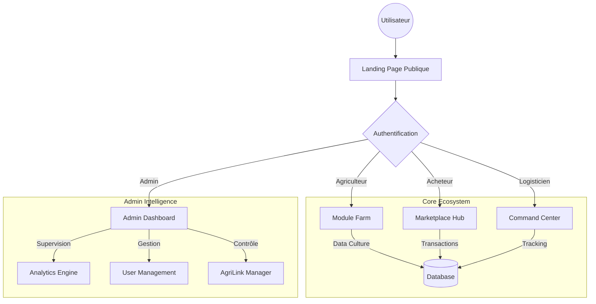

# 🌾 AgriLogistic V3.0 - Plateforme Agritech Intégrée


---

## 🌍 Vision : Révolutionner l'Agriculture Africaine

**AgriLogistic V3.0** est bien plus qu'une simple application : c'est un écosystème numérique complet conçu pour connecter, optimiser et sécuriser l'ensemble de la chaîne de valeur agricole en Afrique de l'Ouest.

De la gestion parcellaire assistée par IA à la logistique du "dernier kilomètre", nous apportons une transparence totale et des outils de pointe (Jumeaux Numériques, IoT, Blockchain) aux acteurs qui nourrissent le continent.

---

## 🏗️ Architecture du Système

Le système est construit sur une architecture modulaire et évolutive, orchestrée autour d'un **Core applicatif central (Web App)** qui dessert différents portails selon le rôle de l'utilisateur.



---

## 🛠️ Stack Technique

### 🎨 Frontend (Apps/Web-App)
| Technologie | Usage |
| :--- | :--- |
| **Next.js 14** | Framework React Fullstack (App Router) |
| **react-three-fiber** | Visualisation 3D (Jumeaux Numériques) |
| **Leaflet / React-Leaflet** | Cartographie interactive et Tracking |
| **Recharts** | Visualisation de données et Analytics |
| **Tailwind CSS v4** | Moteur de styling utilitaire |
| **Radix UI / Shadcn** | Composants d'interface accessibles |
| **Zustand** | Gestion d'état global léger |

### ⚙️ Backend & Outils
| Technologie | Usage |
| :--- | :--- |
| **Node.js** | Runtime environnement |
| **TurboRepo** | Gestion du Monorepo |
| **Playwright** | Tests End-to-End (E2E) |
| **Vitest** | Tests Unitaires |
| **Docker** | Conteneurisation (Prêt pour dépoiement) |

---

## 🧩 Écosystème de Fonctionnalités

### 🚀 Modules Publics
Ces modules sont accessibles depuis la page d'accueil ou via le portail utilisateur.

| Module | Description | Fonctionnalités Clés |
| :--- | :--- | :--- |
| **🌿 AgriLogistic Farm** | Gestion d'exploitation | • Jumeau Numérique 3D des parcelles<br>• Suggestions IA (Irrigation, Récolte)<br>• Académie & Ressources Vidéo |
| **🚚 AgriLogistic Link** | Logistique & Transport | • Carte de commande temps réel<br>• Matching Cargaison/Camion<br>• Comparateur d'itinéraires (Eco/Rapide) |
| **🛒 Marketplace** | Vente & Achat | • Vitrine de produits certifiés<br>• Traçabilité Blockchain<br>• Mise en relation directe |

### 🎛️ Modules Admin
Réservés aux administrateurs pour la supervision globale.

| Module | Description | Fonctionnalités Clés |
| :--- | :--- | :--- |
| **📊 Cockpit Global** | Vue d'ensemble | • Heatmap mondiale des flux<br>• Alertes IoT prédictives<br>• Graphes Offre vs Demande |
| **🚜 Link Manager** | Gestion Flotte & Fret | • CRUD complet des livraisons<br>• Assignation intelligente de chauffeurs<br>• Suivi des incidents |
| **🌾 Crop Intelligence** | Analyse Agronomique | • Suivi des rendements par région<br>• Détection précoce de maladies (Simulé)<br>• Rapports météo |

---

## 👥 Rôles Utilisateurs

| Rôle | Accès & Permissions |
| :--- | :--- |
| **👨‍🌾 Agriculteur** | Saisie des récoltes, gestion des parcelles 3D, accès aux formations, vente sur Marketplace. |
| **🚚 Transporteur** | Accès aux offres de fret, gestion de flotte, navigation et feuilles de route. |
| **🏭 Acheteur** | Sourcing de produits, négociation de contrats, suivi des commandes. |
| **👨‍💼 Admin** | **Accès Total** : Supervision, modération, gestion des utilisateurs, analytique avancée. |

---

## ⚡ Installation & Démarrage

### Pré-requis
- Node.js 18+
- pnpm 9+
- Git

### Lancement Rapide

1.  **Cloner le projet**
    ```bash
    git clone https://github.com/Archimed-Anderson/AgriLogistic.git
    cd AgroDeep
    ```

2.  **Installer les dépendances**
    ```bash
    pnpm install
    ```

3.  **Lancer le serveur de développement**
    Ce script lance simultanément l'application web et les services nécessaires.
    ```bash
    pnpm dev
    ```
    > L'application sera accessible sur `http://localhost:3000`

### 🔄 Workflow de Mise à Jour (Nouveau)
Pour faciliter vos prochains envois vers GitHub, utilisez le script inclus :
```powershell
./PUSH_CHANGES.ps1 -Message "Description de vos changements"
```

### Commandes Utiles
- `pnpm build` : Construire pour la production.
- `pnpm test:e2e` : Lancer les tests Playwright.
- `pnpm lint` : Vérifier la qualité du code.

---

## 🗺️ Roadmap & Futur

| Statut | Fonctionnalité | Description |
| :--- | :--- | :--- |
| ✅ | **Architecture V3** | Migration Next.js 14, Clean Architecture. |
| ✅ | **Modules Core** | Farm, Marketplace, Link opérationnels. |
| ✅ | **Admin V2** | Dashboard complet avec Analytics temps réel. |
| 🚧 | **IA Prédictive** | Intégration réelle de modèles ML pour les récoltes. |
| 🔮 | **Blockchain** | Smart Contracts pour les paiements automatisés. |

---

**AgriLogistic Team** - *Cultiver l'avenir, Connecter le monde.*
