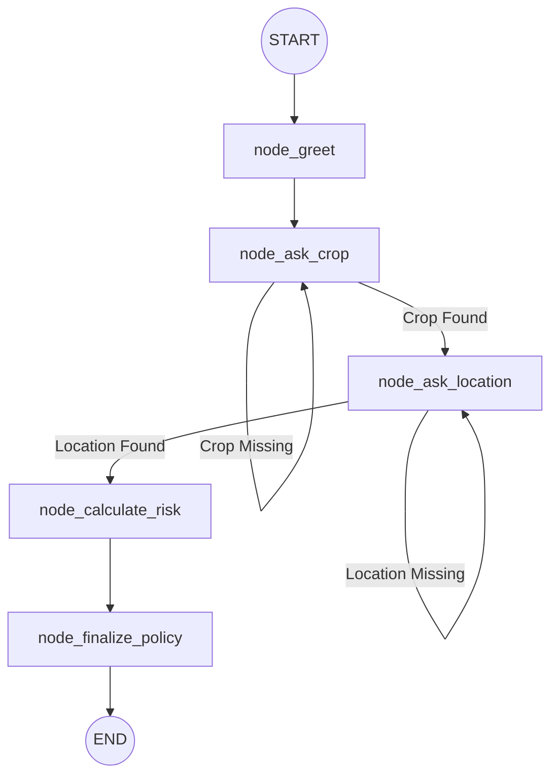

# Agri-Insurance Agent Graph Schema

## State Data Structure
- `user_id`: unique WhatsApp identifier (from Twilio).
- `last_message`: string, the latest input from the user.
- `conversation_history`: list of message objects for context.
- `current_step`: string (e.g., 'getting_crop').
- `insurance_data`: JSON object containing `crop`, `location`, `risk_score`.

## Integration points
1. **Ollama**: Mistral models run locally for intent extraction and natural language generation.
2. **Open-Meteo**: Queried during `calculate_risk` to adjust premiums based on real-time drought/flood data.
3. **Twilio**: Acts as the gateway between WhatsApp users and our FastAPI webhook.
